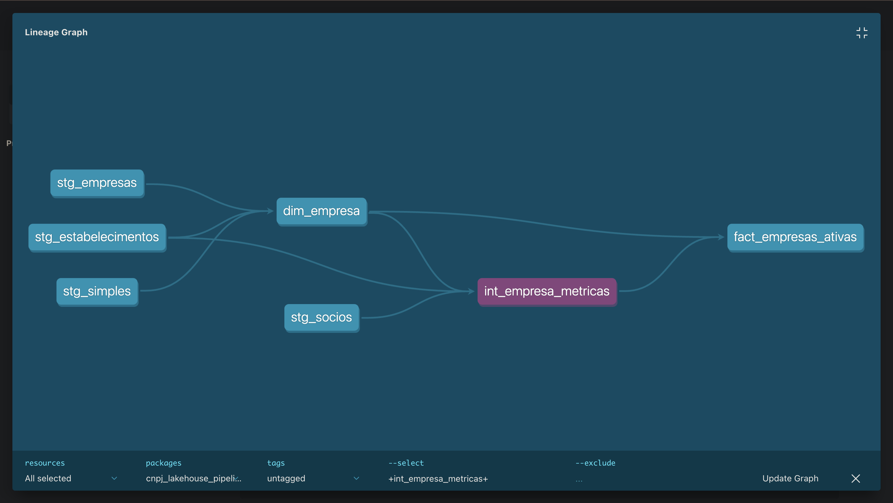

# cnpj-lakehouse-pipeline

Pipeline analitico local para dados publicos de CNPJ, construido com `dbt Core`, `DuckDB` e `Prefect`.

## Objetivo

Este projeto implementa um fluxo de engenharia de dados com foco em:

- ingestao de amostras dos arquivos publicos de CNPJ
- padronizacao e modelagem em camadas com `dbt`
- controles de qualidade de dados com testes automatizados
- historizacao de mudancas com `snapshot` SCD Type 2
- orquestracao do pipeline com `Prefect`

## Stack

- `Python`
- `dbt-core`
- `dbt-duckdb`
- `DuckDB`
- `Prefect`

## Estrutura do Projeto

```text
.
├── analyses/
├── data/
│   ├── cnpj.duckdb
│   └── raw/
├── docs/
├── flows/
│   ├── pipeline_flow.py
│   └── regenerate_matched_samples.py
├── macros/
├── models/
│   ├── intermediate/
│   ├── marts/
│   │   ├── dim/
│   │   └── fact/
│   └── staging/
├── seeds/
├── snapshots/
├── tests/
└── dbt_project.yml
```

## Dados Utilizados

O pipeline usa amostras locais derivadas dos arquivos publicos de CNPJ:

- `Empresas`
- `Estabelecimentos`
- `Socios`
- `Simples`
- `CNAE`
- tabelas auxiliares de apoio, como `Municipios`, `Naturezas` e `Qualificacoes`

As amostras sao geradas a partir dos arquivos brutos em `data/raw/`. Nesta versao, a amostragem foi refinada para usar um conjunto casado de `cnpj_basico`, aumentando a coerencia entre `empresas`, `estabelecimentos`, `socios` e `simples`.

## Modelagem

### Camada staging

Padronizacao e tipagem dos arquivos brutos:

- `stg_empresas`
- `stg_estabelecimentos`
- `stg_socios`
- `stg_simples`
- `stg_cnaes`

### Camada intermediate

Modelos de consolidacao para desacoplar regras analiticas das camadas de consumo:

- `int_empresa_metricas`

### Camada marts

Dimensoes e fato analitico:

- `dim_cnae`
- `dim_empresa`
- `fact_empresas_ativas`

## Funcionalidades Implementadas

- projeto `dbt` estruturado em camadas
- materializacao `incremental` na fato principal
- `snapshot` SCD Type 2 para historico de `capital_social`
- `12` testes de qualidade passando
- `3` macros Jinja reutilizaveis
- flow no `Prefect` para gerar amostras e executar `dbt run` + `dbt test`
- amostragem casada por `cnpj_basico` para aumentar consistencia entre os datasets
- camada `intermediate` para consolidacao de metricas por empresa

## Macros

Macros criadas para apoiar limpeza e padronizacao:

- `normalize_text`
- `parse_br_decimal`
- `parse_yyyymmdd`

## Testes

Foram implementados testes de:

- `not_null`
- `unique`
- `relationships`
- `accepted_values`

## Snapshot

O snapshot `snp_empresas_capital_social` rastreia mudancas no campo `capital_social` usando estrategia `check`, simulando historizacao de alteracoes cadastrais.

## Orquestracao

O flow executa:

1. geracao das amostras locais
2. regeneracao de amostras casadas para maior coerencia entre os datasets
3. `dbt run`
4. `dbt test`

Arquivo principal: `flows/pipeline_flow.py`

## Como Executar

### 1. Ativar ambiente

```bash
source .venv/bin/activate
```

### 2. Validar configuracao

```bash
dbt debug
```

### 3. Executar modelos

```bash
dbt run
```

### 4. Executar testes

```bash
dbt test
```

### 5. Executar snapshot

```bash
dbt snapshot
```

### 6. Executar orquestracao com Prefect

```bash
python flows/pipeline_flow.py
```

## Lineage

O diagrama abaixo mostra o lineage principal do pipeline, conectando os modelos de staging, a dimensao consolidada de empresa e a fato analitica principal.



## Observacoes

- o projeto foi desenhado para rodar localmente com `DuckDB`
- a ingestao usa amostras para reduzir tempo de execucao
- a amostragem foi ajustada para melhorar o relacionamento entre os datasets usados no desafio
- a estrutura foi pensada para facilitar futura migracao para `BigQuery`
